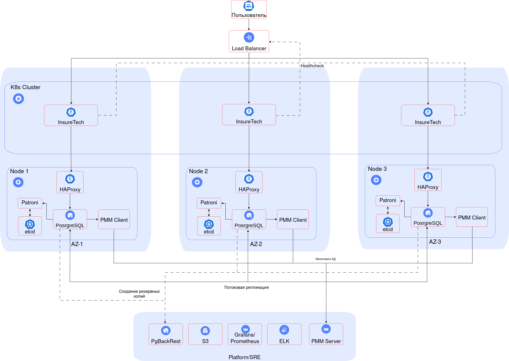

# Описание

НФТ:

- RTO (время восстановления) = 45мин
- RPO (точка восстановления) = 15мин
- Одинаковое время загрузки страниц для пользователей из разных регионов

1. Принято решение разворачивать приложение в 3х зонах доступности в одном регионе с растянутым кластером Kubernetes:
   - Один control plane упрощает управление кластером а так-же уменьшает стоимость эксплуатации.
   - Задержка репликации данных между регионами выше чем задержка запроса из одного региона в другой в рамках РФ.
   - Одинаковое время загрузки страниц для пользователей из разных регионов обеспечивается за счёт использования CDN.
   - Infrastructure as a Code позволит легко масштабировать приложение в мульти-региональную архитектуру в будущем.

2. Балансировка нагрузки между зонами будет осуществляться внешним балансировщиком, который будет направлять трафик на разные зоны в зависимости от доступности сервисов в них. Так же он будет исполнять роль Rate Limiter'а.

3. Будет использована active-active фейловер-стратегия.

4. Для управления кластером баз данных будет использован Postgres Patroni. Patroni - это система управления высокодоступными кластерами PostgreSQL, которая обеспечивает автоматическое восстановление и управление репликацией.

5. На текущий момент (объем БД 50GB), шардирование базы данных будет избыточным.
