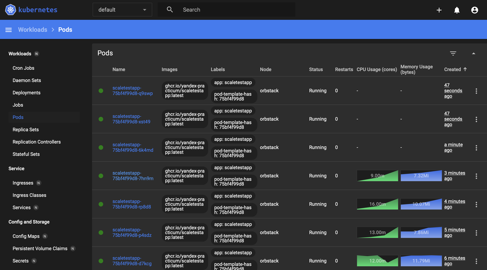

# Запуск

Установка зависимостей (необходимо выполнять из директории Task2)

```bash
pip install -r requirements.txt
```

Применение манифестов (необходимо выполнять из директории Task2)

```bash
kubectl apply -f deployment.yaml
kubectl apply -f service.yaml
kubectl apply -f hpa.yaml
```

Проброс портов

```bash
kubectl port-forward svc/scaletestapp-service 8080:8080
kubectl proxy
```

Запуск locust 

```bash
python locustfile.py
```

Для корректной работы пришлось снизить порог с 80% до 50%


