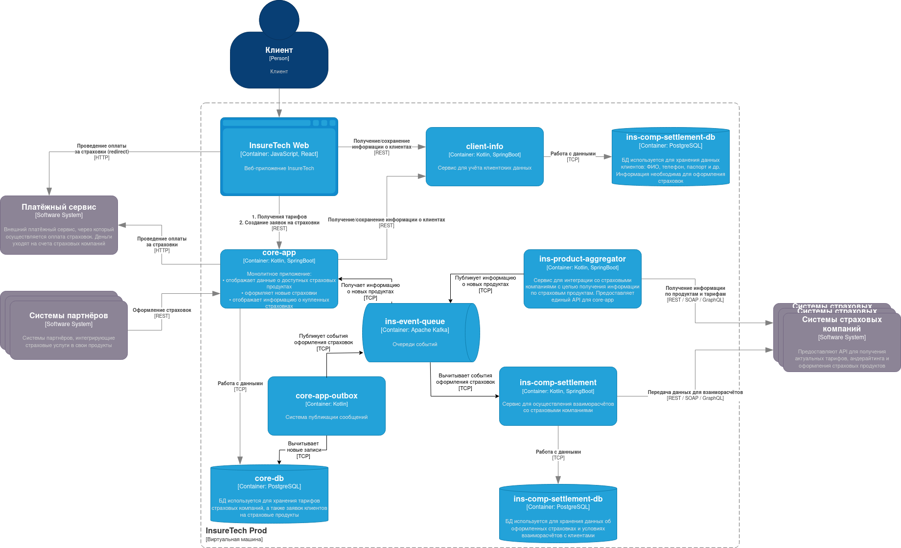

# Выявленые проблемы

1. Синхронные запросы к внешним API
   - Если API одной из страховых компаний медленное или недоступно, то `ins-comp-aggregator` блокируется
   - Влияние на `core-app` и `ins-comp-settlement`: задержки и ошибки при REST-запросах
   - С добавлением ещё 5 компаний, синхронные запросы могут значительно увеличивать время ответа `ins-comp-aggregator`

2. Частота опроса
   - `ins-comp-settlement` опрашивает раз в сутки, `core-app` раз в 15 минут, если `ins-comp-aggregator` недоступен, данные не будут актуальны долгое время.

3. Дублирование данных в нескольких сервисах
   - Локальные реплики создают риск рассинхронизации.
   - При большом числе сервисов и компаний — поддержка консистентности станет сложной.

4. REST-зависимость между сервисами
   - `ins-comp-settlement` зависит от `core-app` для получения страховок
   - REST-зависимости вызывают «узкие места», если один сервис недоступен, то остальные тоже могут быть недоступными

# Предложения по оптимизации

1. `ins-comp-aggregator` сам опрашивает страховые компании и публикует результаты в брокер сообщений
   - `core-app` и `ins-comp-settlement` подписываются на события брокера
   - Таким образом, синхронных зависимостей не будет

2. В `core-app` необходимо применить Transactional Outbox при оформлении страховки
   - `ins-comp-settlement` теряет REST зависимость от `core-app`, Transactional Outbox гарантирует, что данные не будут утеряны

