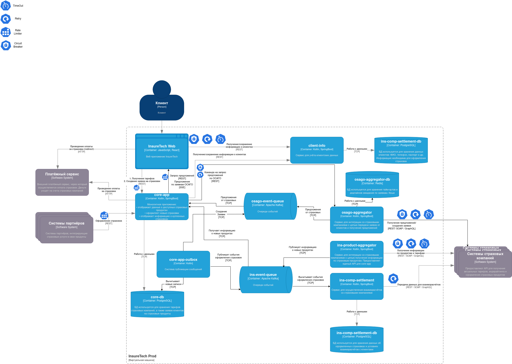

# Предложеное решение

1. `osago-aggregator` будем иметь собственное хранилище (Redis) для кэша, а так же хранения тайм-аутов и пр
2. Полученные от страховых данные по ОСАГО будут публиковаться в очередь
3. Отправка данных веб-приложению будет проимходить с помощью SSE
4. Веб-приложение, а так же системы партнеров отправляют данные по ОСАГО в `core-app` по REST
5. Все обращения к `core-app` будут проходить через Rate Limiter, запросы к внешним и внутренним сервисам желательно проводить с дополнительными попытками (Retry), запросы на внешние сервисы снабдить Circuit Breaker'ами

# OSAGO AGGREGATOR

